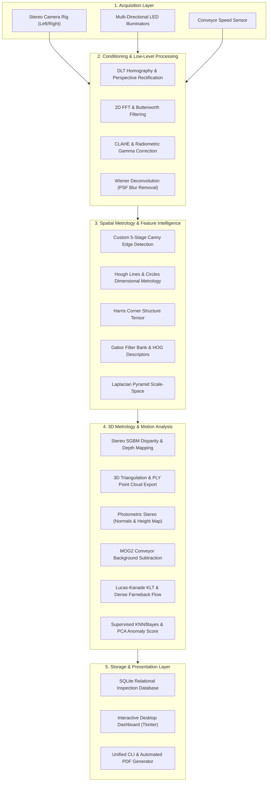
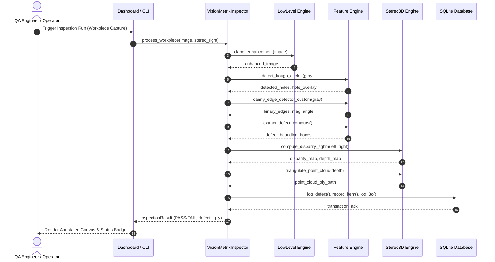
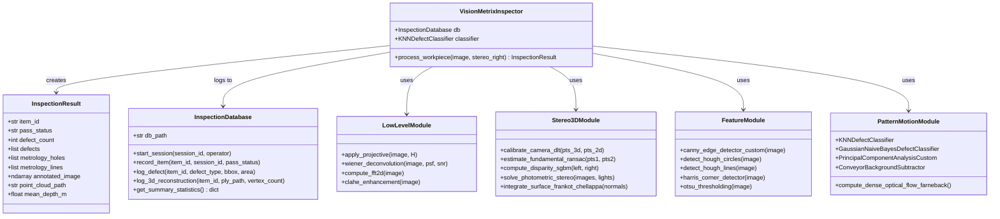

# VisionMetrix 3D (VM3D) — Architectural Specification

## 1. Architectural Overview
VisionMetrix 3D utilizes a deterministic Pipe-and-Filter architecture organized into five distinct layers:
1. **Acquisition & Simulation Layer:** Manages physical or synthetic camera triggers, stereo baselines, and multi-directional lighting sources.
2. **Preprocessing & Conditioning Layer:** Normalizes radiometric variations and restores optical/vibration blurs.
3. **Spatial Metrology & Feature Intelligence Layer:** Identifies edges, geometric primitives, corners, and surface textures.
4. **3D Reconstruction & Dynamic Pattern Layer:** Solves stereo disparity, photometric shape-from-shading, and conveyor motion tracking.
5. **Storage, UI & Decision Layer:** Persists audit logs in SQLite, renders interactive GUI controls, and manages PASS/FAIL verdicts.

---

## 2. System Architecture Diagram

---

## 3. Sequence Diagram (Inspection Cycle)

---

## 4. Class & Component Diagram

