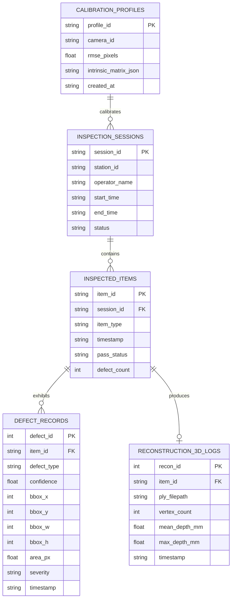

# VisionMetrix 3D (VM3D) — Relational Database Schema & ER Design

## 1. Relational Database Overview
VisionMetrix 3D implements an embedded SQLite relational database (`visionmetrix_inspection.db`) providing:
- Full traceability for manufacturing quality control compliance (ISO 9001 / AS9100).
- Foreign-key integrity between inspection runs, individual workpieces, detected defects, and 3D point cloud assets.
- Rapid indexing and statistical yield reporting.

---

## 2. Entity-Relationship (ER) Diagram

---

## 3. Table Schema Definitions

### Table: `inspection_sessions`
- `session_id` (TEXT, PK): Unique session identifier (e.g. `SESSION_2026_09_17_01`).
- `station_id` (TEXT): Inspection hardware bay identifier (e.g. `STATION_01`).
- `operator_name` (TEXT): QA engineer or operator running the inspection batch.
- `start_time` (TEXT, ISO-8601): Timestamp when session commenced.
- `end_time` (TEXT, ISO-8601): Timestamp when session concluded.
- `status` (TEXT): `RUNNING`, `COMPLETED`, `ABORTED`.

### Table: `inspected_items`
- `item_id` (TEXT, PK): Physical serial number or barcode of the workpiece.
- `session_id` (TEXT, FK): References `inspection_sessions(session_id)`.
- `item_type` (TEXT): Component family (e.g. `PCB_SURFACE`, `MACHINED_BEARING`).
- `timestamp` (TEXT, ISO-8601): Ingestion timestamp.
- `pass_status` (TEXT): `PASS` or `FAIL`.
- `defect_count` (INTEGER): Total count of anomalous regions identified.

### Table: `defect_records`
- `defect_id` (INTEGER, PK, AUTOINCREMENT): Unique defect primary key.
- `item_id` (TEXT, FK): References `inspected_items(item_id)`.
- `defect_type` (TEXT): Classification: `Scratch`, `Micro-Crack`, `Pinhole`, `Solder Bridge`.
- `confidence` (REAL): Classifier posterior probability $[0.0, 1.0]$.
- `bbox_x`, `bbox_y`, `bbox_w`, `bbox_h` (INTEGER): Bounding box in pixel coordinates.
- `area_px` (REAL): Contour pixel area.
- `severity` (TEXT): `CRITICAL`, `HIGH`, `MEDIUM`, `LOW`.
- `timestamp` (TEXT, ISO-8601): Detection timestamp.

### Table: `reconstruction_3d_logs`
- `recon_id` (INTEGER, PK, AUTOINCREMENT): Unique 3D reconstruction identifier.
- `item_id` (TEXT, FK): References `inspected_items(item_id)`.
- `ply_filepath` (TEXT): Relative path to standard Polygon File Format (`.ply`).
- `vertex_count` (INTEGER): Total 3D points in dense point cloud.
- `mean_depth_mm` (REAL): Mean triangulated depth in millimeters.
- `max_depth_mm` (REAL): Peak triangulated elevation in millimeters.
- `timestamp` (TEXT, ISO-8601): Reconstruction timestamp.
